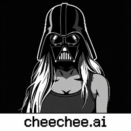

<p align="center">
  
</p>

# Cheechee! Claude Code for DJing

[](LICENSE)
[](https://cheechee.vercel.app)

**DJ harness: LangChain agent x Tone.js.** An AI agent gets two decks, EQ, a crossfader and a mic, and runs the party for you.

> *"who put the playlist on shuffle again"*

It's your birthday. Forty people in the living room, one Bluetooth speaker, and a Spotify playlist that jumps from Berlin techno to a sad acoustic cover of Wonderwall. Every song ends in dead silence. Someone grabs your phone. Now it's ABBA.

You can't afford a DJ. So Cheechee is the DJ: it picks the next track, times the handoff, fades it in, and talks back when you shout "more bass!" at it.

**[Try it live →](https://cheechee.vercel.app)**

---

### How it works

- **Tone.js** plays and mixes everything in the browser: two decks, 3-band EQ, filters, crossfades.
- **A LangChain agent** (any tool-calling model on Nebius) gets DJ tools. `apply_mix` for your requests, `submit_dj_decision` for Autopilot.
- **Autopilot** prepares the next track while the current one plays, then hands off on time. If the model is slow or down, a local fallback keeps the music going. The party never stops.
- **Voice** (optional, ElevenLabs): hold the mic, say "play something harder", hear the DJ answer.
- **A filmed DJ** on stage mirrors every real move. The video follows the audio, never the other way around.

Every decision the agent makes shows up in the Actions panel with its reasoning, so you can see why it dropped that track.

---

### Run it locally

Needs Node 22+.

```bash
npm install
cp .env.example .env   # add your keys
npm run dev            # http://127.0.0.1:5173
```

Click **Enable audio**, flip **Autopilot** on, go get a drink.

Manual mixing works with no keys at all. For the agent and voice, fill in `.env`:

```dotenv
NEBIUS_API_KEY=...
NEBIUS_MODEL=...          # any tool-calling model on your account
ELEVENLABS_API_KEY=...    # optional, for voice
```

Bring your own music: import up to 10 local files (25 MB each). They stay in your browser.

---

### Tests

```bash
npm run typecheck && npm test && npm run test:e2e
```

---

### Known limits

It's a party DJ, not a club DJ. No beat matching, no key matching. Autopilot only runs while the tab is open and awake.

---

MIT · Music by [Play House](https://freemusicarchive.org/music/play-house/) (CC0), see [attribution](public/audio/ATTRIBUTION.md)
